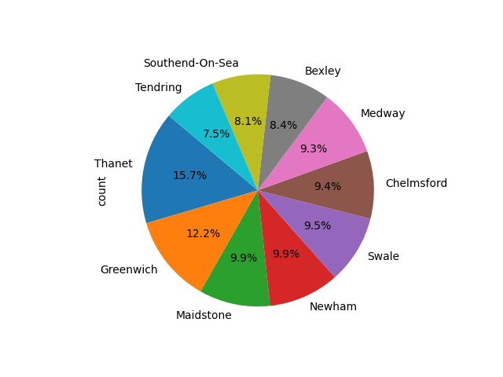

# Background

The UK Food Standards Agency evaluates various establishments across the United Kingdom, and gives them a food hygiene rating. You've been contracted by the editors of a food magazine, Eat Safe, Love, to evaluate some of the ratings data in order to help their journalists and food critics decide where to focus future articles.

## Data Source

- [Establishments Data Source](https://github.com/fabiomarcullo/nosql-challenge/tree/main/Resources)
   - Import the dataset with mongoimport --type json -d uk_food -c establishments --drop --jsonArray establishments.json

## Jupyter Notebook

- [NoSQL Setup](https://github.com/fabiomarcullo/nosql-challenge/blob/main/NoSQL_setup_starter.ipynb)
- [NoSQL Analysis](https://github.com/fabiomarcullo/nosql-challenge/blob/main/NoSQL_analysis_starter.ipynb)

## Exploratory Analysis

### 1. Which establishments have a hygiene score equal to 20?
      There are 41 establishments with a hygiene score of 20 from the `uk_food` dataset.
   
### 2. Which establishments in London have a RatingValue greater than or equal to 4?

    There are 34 establishments in London that have a RatingValue greater than or equal to 4 from the `uk_food` dataset.

## 3. What are the top 5 establishments with a RatingValue of 5, sorted by lowest hygiene score, nearest to the new restaurant added, "Penang Flavours"?

      The top 5 establishments with a RatingValue of '5' sorted by lowest hygiene score nearest to "Penang Flavours" are: 
      
        "Volunteer" 
        "Plumstead Manor Nursery"
        "Atlantic Fish Bar"
        "Iceland"
        "Howe and Co Fish and Chips - Van 17". 
   
### 4. How many establishments in each Local Authority area have a hygiene score of 0? 
   ### Sort the results from highest to lowest, and print out the top ten local authority areas.
      
      There are 55 rows in the DataFrame. 
   
      This is the preview of the first 10 rows:
   

  
  <table>
    <thead>
      <tr>
        <th>_id</th>
        <th>count</th>
      </tr>
    </thead>
    <tbody>
      <tr>
        <td>Thanet</td>
        <td>1130</td>
      </tr>
      <tr>
        <td>Greenwich</td>
        <td>882</td>
      </tr>
      <tr>
        <td>Maidstone</td>
        <td>713</td>
      </tr>
      <tr>
        <td>Newham</td>
        <td>711</td>
      </tr>
      <tr>
        <td>Swale</td>
        <td>686</td>
      </tr>
      <tr>
        <td>Chelmsford</td>
        <td>680</td>
      </tr>
      <tr>
        <td>Medway</td>
        <td>672</td>
      </tr>
      <tr>
        <td>Bexley</td>
        <td>607</td>
      </tr>
      <tr>
        <td>Southend-On-Sea</td>
        <td>586</td>
      </tr>
      <tr>
        <td>Tendring</td>
        <td>542</td>
      </tr>
    </tbody>
  </table>

